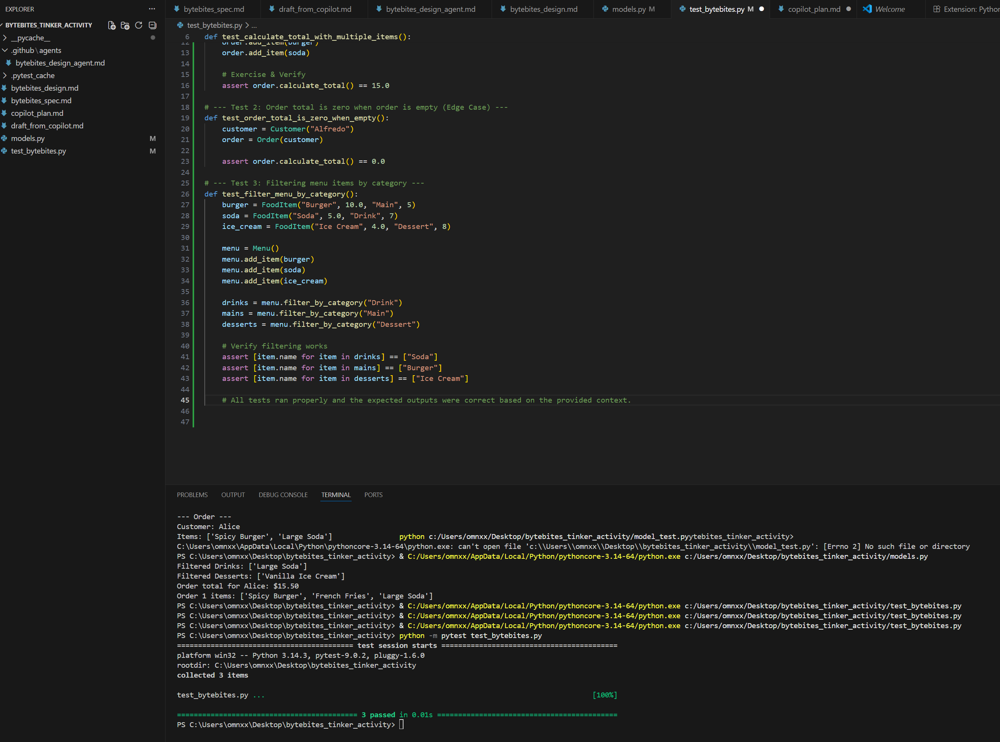

# ByteBites Tinker Activity

## Final Reflection

This tinker involved designing and implementing using Copilot & Agent for **ByteBites**, a food ordering app. Our system models four main components:

- **Customer** – stores customer information and purchase history.
- **FoodItem** – stores details for each menu item, including price, category, and popularity.
- **Menu** – manages the collection of food items and supports filtering by category.
- **Order** – groups selected items for a customer and calculates the total cost.

### Summary of Work

During this Tinker, I:

1. **Designed the system** using a UML diagram to represent the four core classes and their relationships.
2. **Implemented Python classes** with constructors, attributes, and methods for adding items, filtering menus, and calculating order totals.
3. **Created and ran test cases** using `pytest` to verify core functionality and edge cases.
4. **Used AI-assisted tools** (Copilot and a custom ByteBites Design Agent) to help draft class scaffolds, methods, and test ideas while maintaining full oversight of the code.

### Test Results

The following screenshot shows all tests passing successfully, confirming the system works as intended:

  

- **Core Concept Students Needed to Understand**: Object-oriented design, including how to break down a system into classes, attributes, and methods that interact logically.  
- **Where Students Are Most Likely to Struggle**: Assigning clear responsibilities to each class, ensuring proper relationships between objects, and implementing methods that accurately reflect the UML design.  
- **Where AI Was Helpful vs Misleading**: AI was helpful for generating class scaffolds, drafting methods, creating UML diagrams, and suggesting test cases. It was misleading when it added unnecessary complexity or suggested features not in the spec.  
- **Guidance Without Giving Away the Answer**: Ask students to describe in plain language what each class should represent and what data it should store before writing any code. This helps with design intent without providing direct implementation.
